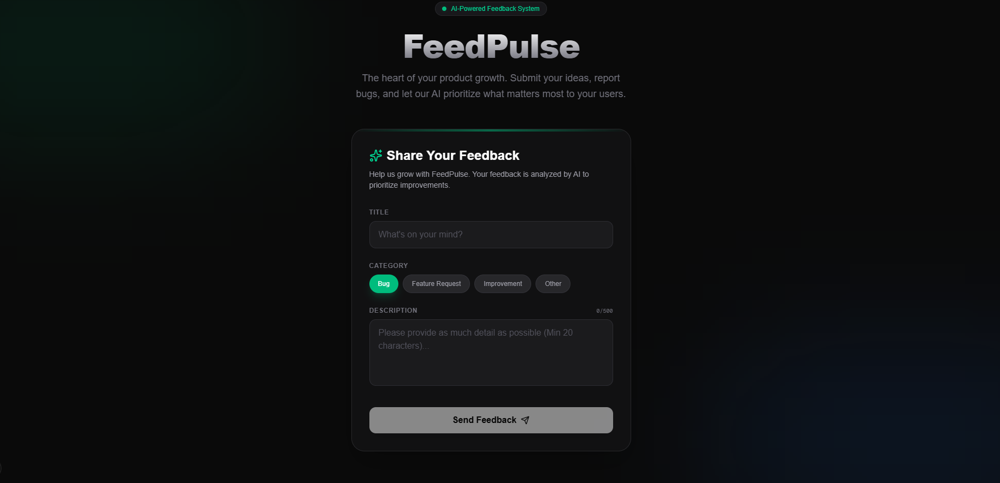
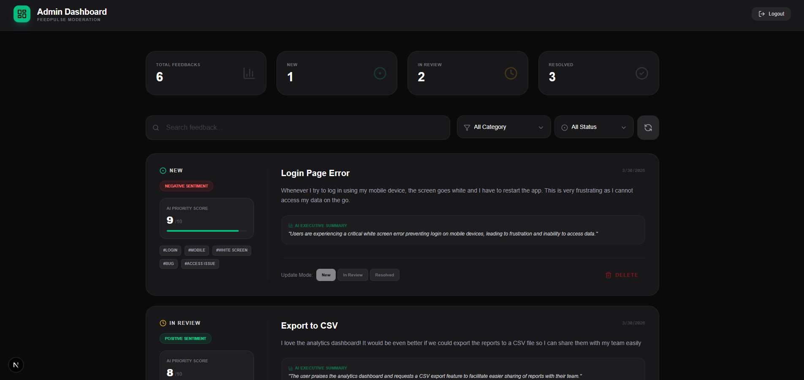

# 🌊 FeedPulse - AI-Powered Feedback System

**FeedPulse** is a modern, high-performance web application designed to capture, analyze, and prioritize user feedback using advanced AI. Built with a premium aesthetic and powered by Google Gemini, it transforms raw feedback into actionable insights for product teams.

## ✨ Features

- **🤖 AI-Powered Analysis**: Automatically analyzes sentiment, suggests categories, and assigns priority scores to every feedback using Google Gemini 2.5.
- **🛡️ Premium Admin Portal**: Secure dashboard for managing feedback with JWT authentication.
- **📊 Real-time Monitoring**: Track incoming feedback and AI analysis progress in real-time.
- **🎨 Modern Dark UI**: Sleek, glassmorphic design built with Framer Motion and TailwindCSS.
- **🐳 Dockerized Deployment**: Run the entire stack (Frontend, Backend, MongoDB) with a single command.

---

## 🚀 Quick Start

### Prerequisites
- [Docker & Docker Compose](https://www.docker.com/products/docker-desktop/)
- [Google Gemini API Key](https://aistudio.google.com/)

### One-Command Setup
1. Clone the repository:
   ```bash
   git clone https://github.com/Tharuka788/FeedPulse.git
   cd FeedPulse
   ```
2. Start the application:
   ```bash
   docker compose up --build
   ```
3. Access the application:
   - **User Feedback Portal**: [http://localhost:8080](http://localhost:8080)
   - **Admin Dashboard**: [http://localhost:8080/admin/login](http://localhost:8080/admin/login)

---

## 📸 Screenshots

### 💠 User Feedback Portal


### 🛡️ Admin Dashboard


---

## 🔐 Admin Credentials

Default credentials for the Admin Dashboard (configurable in `docker-compose.yml`):
- **Email**: `admin@feedpulse.com`
- **Password**: `admin123`

---

## 🛠️ Technology Stack

### Frontend
- **Framework**: Next.js 15 (App Router)
- **Styling**: TailwindCSS & Vanilla CSS
- **Animations**: Framer Motion
- **Icons**: Lucide React

### Backend
- **Runtime**: Node.js (ESM)
- **Framework**: Express.js
- **Database**: MongoDB (Mongoose)
- **AI Integration**: Google Generative AI (@google/generative-ai)

---

## ⚙️ Configuration (Environment Variables)

### Backend (`/backend/.env`)
| Variable | Description |
| :--- | :--- |
| `PORT` | Backend server port (default: 4000) |
| `MONGO_URI` | MongoDB connection string |
| `GEMINI_API_KEY` | Your Google AI API Key |
| `JWT_SECRET` | Secret key for admin authentication |
| `ADMIN_EMAIL` | Default admin email |
| `ADMIN_PASSWORD` | Default admin password |

### Frontend (`/frontend/.env`)
| Variable | Description |
| :--- | :--- |
| `NEXT_PUBLIC_API_URL` | Backend API URL (default: http://localhost:8081) |

---

## 📁 Project Structure

```text
FeedPulse/
├── backend/            # Express.js Server & AI Logic
│   ├── src/
│   │   ├── controllers/# Business logic
│   │   ├── models/     # MongoDB schemas
│   │   ├── services/   # Gemini AI integration
│   │   └── routes/     # API endpoints
│   └── Dockerfile
├── frontend/           # Next.js Application
│   ├── app/            # App Router (Pages)
│   ├── components/     # UI Components
│   └── Dockerfile
└── docker-compose.yml  # Orchestration for all services
```

---

## 📄 License
This project is licensed under the ISC License.

Developed with ❤️ for the future of product development.
